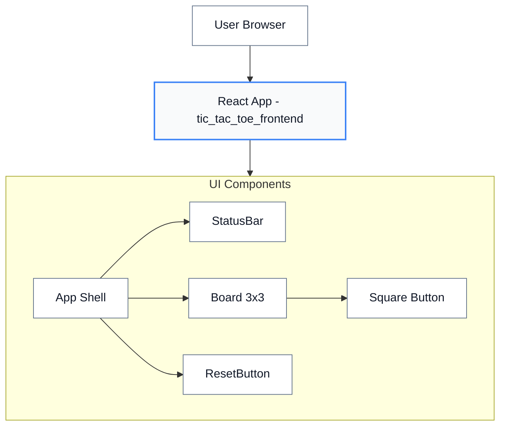
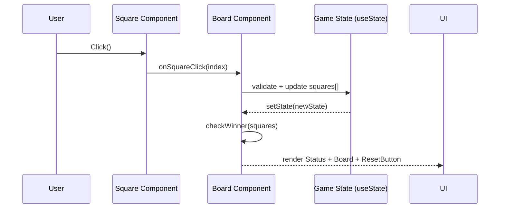
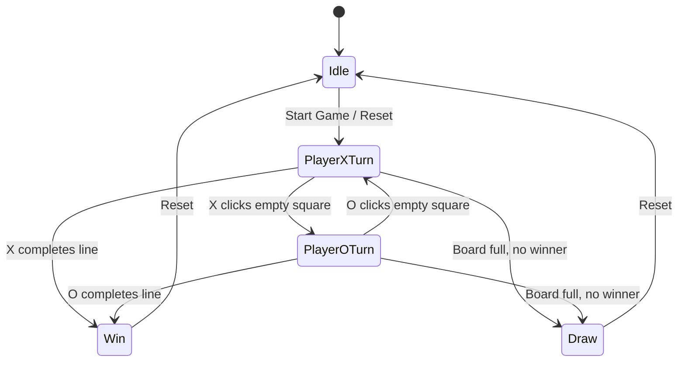

# Tic Tac Toe Frontend - Project Document

## Executive Summary
A modern React-based Tic Tac Toe game for two local players. Provides a 3x3 grid, turn indicator, win/draw detection, and reset functionality. Styled per the Ocean Professional theme.

## Scope and Objectives
- 3x3 grid with responsive UI
- Turn display (X / O)
- Win/draw detection
- Reset to new game
- Clean, accessible design

## System Overview
The app runs entirely in the browser using React, maintaining game state in-memory with functional components and hooks. This frontend is a lightweight web UI with no backend or persistence. The current scaffold includes a theme toggle and a basic application shell that can be extended to incorporate game components such as Board, Square, StatusBar, and ResetButton.

## Architecture

### Key Components
- App: Layout shell, theme toggling, and base styles
- StatusBar: Displays current turn / result
- Board: Grid layout and interaction orchestration
- Square: Interactive cell
- ResetButton: Clears state to initial

Note: As of this version, the codebase includes the App shell with a theme toggle, and the additional components (StatusBar, Board, Square, ResetButton) are design targets for this frontend and should be implemented as part of feature development.

## Component Design
- App: Provides application shell, applies theme via data-theme attribute, renders header and toggler. Uses useState and useEffect to manage and apply theme.
- Board: Intended to hold squares array, currentPlayer, and internal winner logic orchestration.
- Square: Stateless button receiving value and onClick handler for user interactions.
- StatusBar: Derives player turn or result from props and renders status text.
- ResetButton: Triggers state reset to initial empty board and first player.

## Data Flow

State is updated via setState; winner detection runs after each move.

## User Flows

## GxP Compliance Summary
This project targets a simple, local game UI. While it is non-clinical and non-GxP critical, we reference the GxP standards to ensure good engineering practices:
- Audit trail (lightweight, UI-level): Document the concept for an optional timestamped move log with player and position within the UI for transparency; this is not security-backed but can aid validation and traceability in demos. Not currently implemented in code.
- Validation controls: Input guarding to prevent overwriting occupied squares and basic bounds checks should be included in Board logic.
- Error handling: Show user-safe messages or disable invalid interactions (e.g., after win/draw). Avoid console-only errors; use controlled UI states.
- Access controls: Not applicable for local game; non-critical operation and no persistence. Rationale documented here.
- Electronic signature: Not applicable for this use case. If expanded to controlled environments, this would require formal authentication and signature capture mechanisms.
- Data integrity: No persistence; game state resides in-memory. If future persistence is added, follow ALCOA+ principles including timestamps, user attribution, and accuracy checks.

## Testing Strategy
- Unit tests for winner logic, draw detection, and UI state transitions.
- Component tests for interactions (clicks, reset).
- Accessibility checks for focus order and aria-labels (e.g., squares and reset button).
- Snapshot testing for key UI states (initial, mid-game, win, draw) as appropriate.

## Non-Functional Requirements
- Performance: Instant interactions and smooth transitions.
- Accessibility: Buttons with aria-labels and focus styles; color contrast aligned to Ocean Professional palette.
- Theming: Ocean Professional colors with subtle transitions and modern styling.

## Risks and Assumptions
- Assumes single-device, two-player use without backend.
- No persistence or network calls; a refresh will clear the state.
- Scope assumes basic feature set; AI or networked play would be out of scope.

## Release Gate Checklist
- [ ] Inputs validated
- [ ] Move log present (if enabled by design)
- [ ] Unit tests >80% for logic
- [ ] Error handling covered
- [ ] Documentation complete
- [ ] Basic accessibility checks pass

## Traceability Matrix (Summary)
- REQ-UI-001 Grid render → Board/Square → Tests: board render
- REQ-LOGIC-001 Winner calc → checkWinner() → Tests: winner cases
- REQ-UX-001 Reset → ResetButton → Tests: reset state

## Implementation Notes and File References
- App Shell and Theme:
  - File: tic_tac_toe_frontend/src/App.js
    - Manages theme state (light/dark) with useState and applies document data-theme via useEffect.
    - Provides a UI button to toggle theme with accessible aria-labels.
  - File: tic_tac_toe_frontend/src/App.css
    - Defines CSS variables for light/dark themes and applies styling across the app root.
- Application Entry:
  - File: tic_tac_toe_frontend/src/index.js
    - React root creation and rendering in StrictMode.
- Testing Baseline:
  - File: tic_tac_toe_frontend/src/App.test.js
    - Initial test scaffold rendering the App and asserting the "learn react" link.

## Style Guide Alignment (Ocean Professional)
- Colors:
  - Primary: #3b82f6
  - Secondary: #64748b
  - Success: #06b6d4
  - Error: #EF4444
  - Background: #f9fafb
  - Surface: #ffffff
  - Text: #111827
- Application Style:
  - Modern, minimalist UI with subtle shadows and rounded corners.
  - Smooth transitions for theme toggling and interactive components.
  - Clear focus states for keyboard navigation and accessibility.

## Future Enhancements (Non-binding)
- Implement Board, Square, StatusBar, and ResetButton as outlined.
- Add lightweight in-memory move log for audit-like visibility (timestamp, move index, player).
- Provide accessibility enhancements such as role and aria-live updates for status changes.
- Extend tests to include interaction flows and status rendering post-move.
